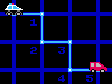

# manhattan
> Calculate the [Manhattan distance](https://en.wikipedia.org/wiki/Manhattan_distance) between two points



This module exposes the function `manhattan(a, b)`, which determines the Manhattan distance between points `a` and `b`.
```js
> const manhattan = require('manhattan')
> manhattan([2, 5], [4, 8])
5
```
<!-- [](https://www.npmjs.com/package/manhattan) -->

## see also
- [`semibran/chebyshev`](https://github.com/semibran/chebyshev) - calculate chebyshev distance
- [`semibran/vector`](https://github.com/semibran/vector) - more vector math
- [`kchapelier/von-neumann`](https://github.com/kchapelier/von-neumann) - find all points within a given Manhattan distance

## license
[MIT](https://opensource.org/licenses/MIT) © [Brandon Semilla](https://git.io/semibran)
